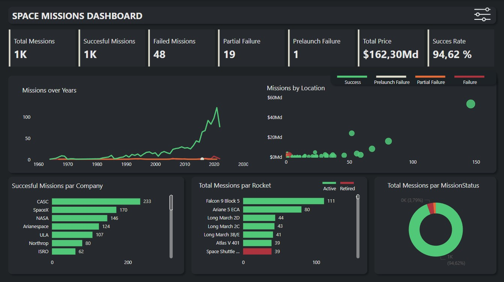

# Space Missions Dashboard

## Overview

This Power BI dashboard provides insights into space missions conducted over the years. It visualizes various aspects of space missions, including launch success rates, Total Missions, location involved, and more.

## Data Sources

The dashboard is built using data sourced from Maven Analytics .

## Usage

1. **Opening the Dashboard**: Open the `.pbix` file using Microsoft Power BI Desktop or the Power BI service.
2. **Interacting with Visualizations**: Click on different elements of the dashboard to filter and drill down into specific information.
3. **Customization**: Feel free to customize the dashboard according to your preferences or specific analytical needs.

## Requirements

- [Microsoft Power BI Desktop](https://powerbi.microsoft.com/desktop/)
- Internet connection for real-time data updates (optional)

